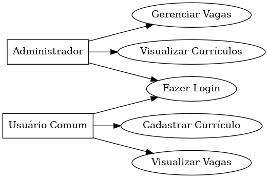
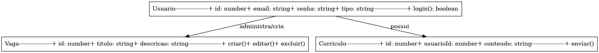
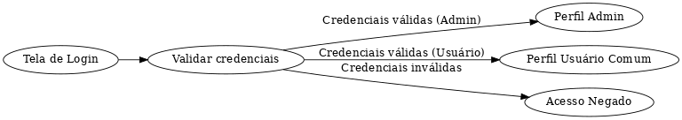

# Projeto RH Connect #

- ESCOPO - 
**Objetivo Geral**
Desenvolver uma aplicação Angular com back-end simulado utilizando json-server, que permita a gestão de vagas e currículos. O sistema deve implementar autenticação (login e registro) e autorização baseada no tipo de usuário (Administrador e Usuário Comum).
O desenvolvimento será realizado em etapas bem definidas:
Levantamento de Requisitos – Identificação das necessidades funcionais e não funcionais do sistema.
**Prototipagem** – Criação das telas e fluxos de navegação no Figma ou ferramenta similar.
**Diagramação** – Definição da arquitetura, rotas e componentes Angular.
**Codificação** – Implementação front-end e integração com o back-end simulado.
-----------------------------------------------------------
1. Funcionalidades Principais
**Área do Candidato (Usuário comum):**
Cadastro de conta (nome, e-mail, senha, dados pessoais).
Login com autenticação JWT.
Cadastro e edição de currículo (formulário completo).
Visualização de vagas disponíveis.
Candidatura a vagas.

**Área do Administrador ( Currículos - RH):**
Login com autenticação JWT.
Cadastro e gerenciamento de vagas (criar, editar, excluir).
Visualização de candidatos cadastrados, e currículos recebidos.
Acompanhamento das candidaturas recebidas.
-----------------------------------------------------------
2. Briefing
**Cliente: RH Connect**
**Responsável pelo Projeto:** Equipe de Desenvolvimento Angular
**Prazo Estimado:** 2 semanas
**Objetivo:** Criar uma aplicação de RH funcional que simule um sistema real com login, autorização por perfil e funcionalidades específicas para cada tipo de usuário.
**Público-Alvo:**
**Candidatos:** Usuários que buscam vagas de emprego e desejam cadastrar seus currículos.
**Administradores:** Colaboradores da empresa responsáveis por gerenciar vagas e candidatos.
**Identidade Visual:**
**Cores:** Azul-escuro #002D62, Cinza-claro #f4f4f4, Branco #FFFFFF.
**Estilo**:** Limpo, corporativo, moderno, de fácil navegação.
**Dispositivos-Alvo:** Desktop e dispositivos móveis (design responsivo).
-----------------------------------------------------------
3.  Stakeholders do Projeto

## Cliente / Solicitante
**Nome:** RH Connect (empresa fictícia)
**Interesse:** Receber um protótipo funcional que atenda ao fluxo de recrutamento interno, com gestão de vagas e currículos.
**Papel:** Fornecer requisitos, validar protótipos, aprovar entregas.
## Usuários Finais
**Usuários Comuns (Candidatos):**
**Interesse:** Criar conta, preencher currículo, visualizar vagas e candidatar-se.
**Papel:** Utilizar a plataforma para buscar oportunidades de emprego.
**Administradores:**
**Interesse:** Criar, editar e excluir vagas; visualizar currículos.
**Papel:** Gerenciar o fluxo de vagas e candidaturas.
-----------------------------------------------------------
4. Descrição Geral

O projeto "Plataforma RH" será uma aplicação feita em Angular, com um back-end simulado usando json-server.
O objetivo é criar um sistema para gerenciar vagas e currículos, com dois tipos de usuários:
Candidato: pode se cadastrar, fazer login, enviar currículo e ver as vagas abertas.
**Administrador:** pode fazer login, criar, editar e excluir vagas, além de visualizar currículos.
O sistema terá login e controle de acesso por perfil, usando guardas de rota. Será responsivo, com design moderno em SCSS, funcionando bem no computador e no celular.
O desenvolvimento seguirá etapas claras: planejamento, protótipos, diagramas e implementação, resultando em um protótipo funcional da empresa fictícia RH Connect.
-----------------------------------------------------------
## Interfaces Previstas
1. Tela de Login
Campos: e-mail, senha.
Botão: "Entrar".
Link para registro.
Mensagem de erro para credenciais inválidas.Redirecionamento baseado no perfil (Admin ou Candidato).

2. Tela de Registro
Campos: nome, e-mail, senha, confirmação de senha.
Tipo de usuário definido automaticamente como "comum" (candidato).
Validação de campos obrigatórios e formato de e-mail.
Link para voltar ao login.

3. Página Pública de Vagas
Lista de vagas disponíveis (cargo, descrição resumida, local).
Botão “Ver detalhes” (abre mais informações).
Acessível sem login.

4. Área do Candidato
Página de Envio de Currículo:
Formulário com dados pessoais, experiências, habilidades e upload (opcional).
Botão “Enviar currículo”.
Visualização de vagas (igual à página pública, mas com opção de candidatar-se).

5. Área do Administrador
Tela de Gerenciamento de Vagas:
Listagem de vagas cadastradas.
Botões: Criar vaga, Editar, Excluir.
Tela de Visualização de Currículos:
Lista de currículos enviados por candidatos.
Botão para ver detalhes de cada currículo.

6. Barra de Navegação (Navbar)
Links exibidos de acordo com o perfil:
Deslogado: Login, Registro, Vagas.
Candidato: Vagas, Meu Currículo, Sair.
Admin: Vagas, Currículos, Sair.

7. Tela de Erro / Acesso Negado
Mensagem informando que o usuário não tem permissão para acessar a página.
Botão para voltar à página inicial.
-----------------------------------------------------------
## Requisitos Funcionais
- Cadastro de Usuário Comum (Candidato)
- Permitir criar conta com nome, e-mail e senha.
- Validar campos obrigatórios e formato de e-mail.
Login
- Autenticar usuários (candidatos e administradores) com e-mail e senha.
- Redirecionar para a área correta conforme o tipo de usuário.
- Gerenciamento de Currículos (Candidato)
- Preencher formulário com informações pessoais, experiências e habilidades.
- Enviar currículo e salvar dados no back-end simulado.
- Visualização de Vagas
- Listar vagas disponíveis para candidatos e público em geral.
- Permitir candidatura às vagas apenas para usuários autenticados como candidatos.
- Gerenciamento de Vagas (Administrador)
- Criar novas vagas, editar e excluir vagas existentes.
- Visualizar detalhes das vagas e currículos enviados.
- Controle de Acesso
- Aplicar restrição de funcionalidades de acordo com o perfil do usuário (Admin ou Candidato).
- Implementar guardas de rota (AuthGuard e AdminGuard) no - Angular.
- Navegação
- Navbar dinâmica, exibindo links conforme o perfil do usuário (Deslogado, Candidato, Admin).
- Mensagens e Alertas
- Exibir mensagens de sucesso ou erro para cadastro, login, envio de currículo e operações CRUD.
-----------------------------------------------------------
## Requisitos Não Funcionais
Desempenho
A aplicação deve carregar em até 3 segundos em conexões comuns de internet.
Usabilidade
Interface intuitiva e fácil de navegar.
Layout responsivo para desktop e dispositivos móveis.
Segurança
Autenticação de usuários e restrição de acesso às funcionalidades por perfil.
Não expor dados sensíveis no front-end.
Manutenibilidade
Código organizado em componentes e serviços reutilizáveis.
Uso de boas práticas Angular (modularização, SCSS estruturado, Reactive Forms).
Portabilidade
Funcionar em navegadores modernos (Chrome, Edge, Firefox).
Confiabilidade
Operações CRUD devem refletir corretamente no back-end simulado (json-server).
Tratamento de erros para ações inválidas ou dados incorretos.
-----------------------------------------------------------
## Requisitos Humanos
1. Equipe de Desenvolvimento
Desenvolvedores Angular
Conhecimento em Angular 16+, TypeScript e componentes.
Experiência com Reactive Forms, SCSS e boas práticas de componentização.
Capacidade de implementar autenticação, autorização e guardas de rota.
Designer UI/UX
Experiência em prototipagem (Figma ou similar).
Criar interfaces responsivas e intuitivas, seguindo a identidade visual da marca.
Gerente de Projeto / Coordenador
Acompanhar prazos, organizar tarefas e revisar entregas.
Comunicação entre cliente e equipe.
Usuários Finais
Candidatos
Saber utilizar computador ou dispositivo móvel para cadastro, login e envio de currículos.
Conhecimento básico de navegação em websites.
Administradores
Capacidade de cadastrar, editar e excluir vagas.
Visualizar currículos enviados e gerenciar o processo seletivo.
Outras Considerações Humanas
Necessidade de treinamento rápido ou documentação para novos usuários administradores.
Garantir que a experiência do usuário seja intuitiva, reduzindo a dependência de suporte técnico.
Capacidade da equipe de interpretar o briefing e protótipos para transformar requisitos em código funcional.Desenvolvimento Angular
Tecnologias
Angular 16+
SCSS customizado
JSON Server
Reactive Forms
LocalStorage para sessão
Guardas de rota
----------------------------------------------------------
## Limites da Plataforma
1. Funcionalidades Não Implementadas
Não haverá integração com sistemas externos de RH (ex.: LinkedIn, Catho). Somente contato por e-mail
Não haverá módulos financeiros ou folha de pagamento.
Não haverá geração de relatórios avançados ou dashboards de métricas complexas.
Casos de Uso

1. Usuário Comum (Candidato)
Caso de Uso
Descrição
Cadastro
Criar uma nova conta na plataforma.
Login
Autenticar-se para acessar funcionalidades restritas.
Preencher Currículo
Inserir informações pessoais, experiências e habilidades.
Enviar Currículo
Submeter o currículo para análise do administrador.
Visualizar Vagas
Consultar vagas disponíveis e candidatar-se.
Logout
Encerrar sessão e voltar à tela inicial.

2. Administrador
Caso de Uso
Descrição
Login
Autenticar-se para acessar área administrativa.
Criar Vagas
Inserir novas vagas no sistema.
Editar Vagas
Modificar informações de vagas existentes.
Excluir Vagas
Remover vagas do sistema.
Visualizar Currículos
Consultar currículos enviados pelos candidatos.
Logout
Encerrar sessão administrativa.

3. Sistema (Funções Gerais)
Caso de Uso
Descrição
Controle de Acesso
Permitir ou negar acesso às páginas conforme o perfil do usuário (Admin ou Comum).
Validação de Formulários
Garantir que os campos obrigatórios sejam preenchidos corretamente.
Persistência Simulada
Armazenar dados de usuários, currículos e vagas usando json-server.
-----------------------------------------------------------
**Objetivo SMART** 

**Específico:** Criar uma aplicação Angular para gerenciar vagas e currículos, permitindo que candidatos se cadastrem, façam login, enviem currículos, e que administradores criem, editem e excluam vagas, com acesso controlado por perfil.
**Mensurável:** O projeto será considerado concluído quando todas essas funcionalidades estiverem funcionando corretamente e o controle de acesso estiver implementado.
**Alcançável:** Será desenvolvido com Angular, SCSS, Reactive Forms e json-server, utilizando boas práticas de código e componentização.
**Relevante:** O sistema simula situações reais de uma empresa de RH, oferecendo experiência prática em autenticação, autorização.
**Temporal:** O protótipo funcional deverá ser concluído em 2 semanas, seguindo etapas de planejamento, prototipagem, diagramas e codificação.
----------------------------------------------------------
## Enunciado da Situação / Desafio

A empresa RH Connect precisa desenvolver um protótipo funcional de seu novo sistema interno de gestão de recrutamento, com foco em controle de acesso por perfil de usuário e fluxo simplificado de recrutamento.
**O sistema deverá:**
- Permitir o cadastro e login de candidatos, com funcionalidade para preenchimento e envio de currículos.
- Permitir o login de administradores, com permissões para criar, editar e excluir vagas.
- Disponibilizar uma listagem pública de vagas para consulta sem login.
- Aplicar restrições de acesso às funcionalidades de acordo com o perfil autenticado (Admin ou Candidato).
- Ser entregue como uma SPA (Single Page Application) responsiva, desenvolvida em Angular, utilizando json-server para simulação de back-end.
- O projeto prioriza usabilidade, organização de código, design moderno e seguir boas práticas de autenticação, autorização e componentização no Angular.
---------------------------------------------------------
## DIAGRAMAS

**- DIAGRAMA CASOS DE USO -**

- 

**- DIAGRAMA DE CLASSES -**
- 

**-DIAGRAMA DE AUTENTICAÇÃO -**
- 

